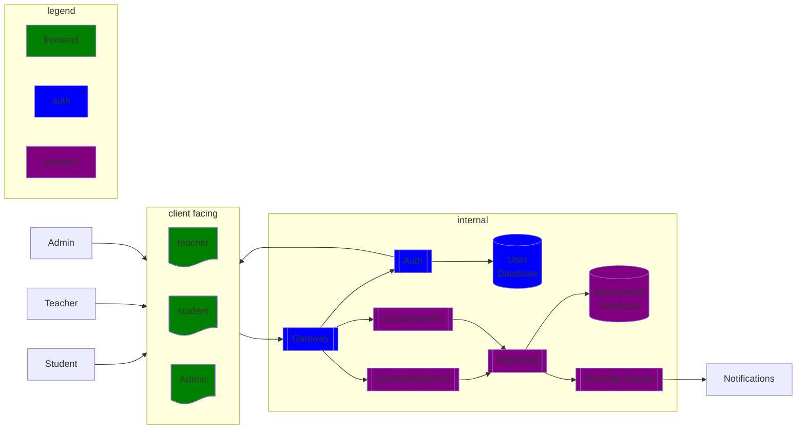

# Phase 1

***student frontend***
  - Class page
  - Authorization:
      * Limited read/write on course.

***Teacher frontend***
  - Class page
  - Authorization:
    * Reading/Writing rights to their owned courses.
    * Reading rights to all courses.

***Admin frontend***
  - Profile pages
  - Class pages
  - Authorization:
    * Read/Write rights to all courses.
    * Read/Write rights to all profiles.

Edtech diagram

