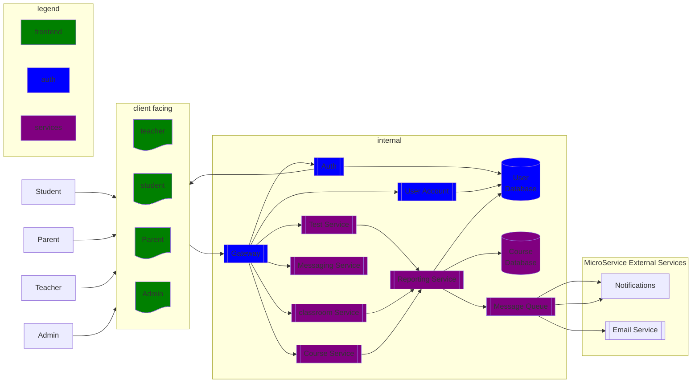

# Phase 2

***Pupil frontend***
  - Their own profile page
  - Class page
  - Communication options with teacher and other pupils.
  - Collaboration space w. teacher/pupils
  - Authorization:
      * Limited view to only see enrolled courses
      * Limited read/write on course. 
      * Limited writing rights on their profiles

***Teacher frontend***
  - Their own profile page
  - Class page
  - Communication options with teachers, pupils and parents.
  - Collaboration space w. teacher/pupils
  - authentication with password and name
  - Authorization:
    * Reading/Writing rights to their owned courses.
    * Reading rights to all courses.
    * Read/Write on their profiles.

***Admin frontend***
  - Profile pages
  - Class pages
  - authentication with password and name
  - Authorization:
    * Read/Write rights to all courses.
    * Read/Write rights to all profiles.

*** Parent frontend ***
  - Children's profile page
  - Limited class page
  - Communication options with teachers.
  - authentication with password and name
  - Authorization:
    * Read-only profile.
    * communicaton only to teachers. 

Edtech diagram

    

