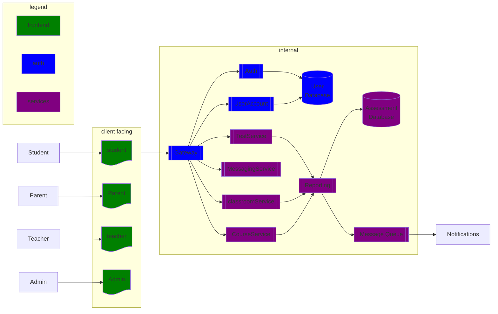

Edtech diagram

```mermaid
flowchart LR
    classDef frontend fill:green
    classDef auth fill:blue
    classDef services fill:purple
    Student[Student] --> SF
    Parent[Parent] --> PF
    Teacher[Teacher] --> TF
    Admin[Admin] --> AF
    
    
    subgraph F[client facing]
        
        TF:::frontend@{ shape: doc, label: "teacher"}
        SF:::frontend@{ shape: doc, label: "student"}
        PF:::frontend@{ shape: doc, label: "Parent"}
        AF:::frontend@{ shape: doc, label: "Admin"}
    end

    F -->  GW --> A
    subgraph B[internal]
        P_DB[(User
        Database)]:::auth

        A[[Auth]]:::auth --> P_DB
        GW[[Gateway]]:::auth    
        Ass[[TestService]]:::services --> R
        GW --> CR & Comm & P & Course & Ass
        CR[[classroomService]]:::services --> R
        Course[[CourseService]]:::services --> R --> DB
        Comm[[MessagingService]]:::services
        P[[UserAccount]]:::auth --> P_DB
        R[[Reporting]]:::services
        DB[(Assessment 
        Database)]:::services

        R --> MQ[[ Message Queue]]:::services
    end

    MQ --> Notifications


    %% Legend
    subgraph legend
        direction LR
        X[frontend]:::frontend
        Y[auth]:::auth
        Z[services]:::services
    end
```

    
    

Questions:

* When is it worth separating the databases (Does it make sense to separate database for user profiles & Course related subjects)?

* 
    