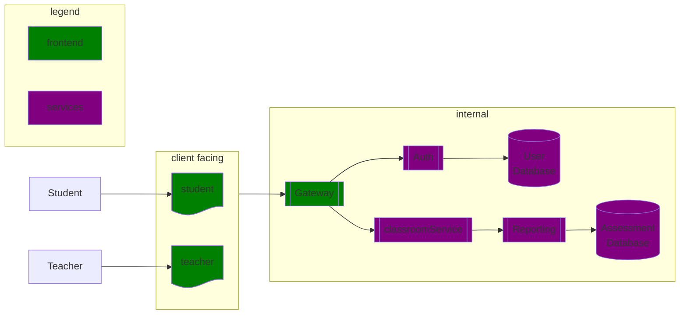

Edtech diagram

```mermaid
flowchart LR
    classDef frontend fill:green
    classDef services fill:purple
    Student[Student] --> SF
    Teacher[Teacher] --> TF
    
    
    subgraph F[client facing]
        TF:::frontend@{ shape: doc, label: "teacher"}
        SF:::frontend@{ shape: doc, label: "student"}
    end

    F -->  GW 
    subgraph B[internal]
        P_DB[(User
        Database)]:::services

        A[[Auth]]:::services --> P_DB
        GW[[Gateway]]:::frontend    
    
        GW --> CR & A
        CR[[classroomService]]:::services --> R
        R[[Reporting]]:::services --> DB[(Assessment 
        Database)]:::services
    end

    %% Legend
    subgraph legend
        direction LR
        X[frontend]:::frontend
        Z[services]:::services
    end
```

    

    