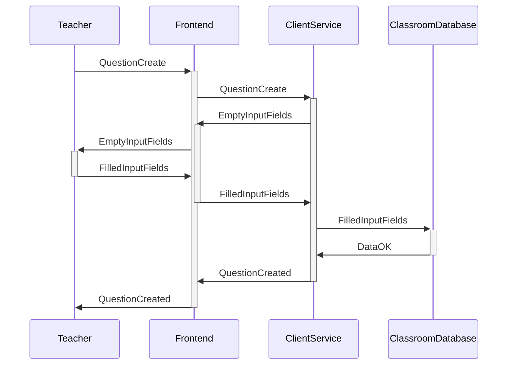

CreateQuestion
2. Teacher post question
    - Teacher client | classroomService

```mermaid
sequenceDiagram
    Teacher ->>+ Frontend: QuestionCreate
    Frontend ->>+ ClientService: QuestionCreate
    ClientService ->>+ Frontend: EmptyInputFields
    Frontend ->>+ Teacher: EmptyInputFields
    Teacher ->>- Frontend: FilledInputFields
    Frontend ->>- ClientService: FilledInputFields
    ClientService ->>+ ClassroomDatabase: FilledInputFields
    ClassroomDatabase ->>- ClientService: DataOK
    ClientService ->>- Frontend: QuestionCreated
    Frontend ->>- Teacher: QuestionCreated
```