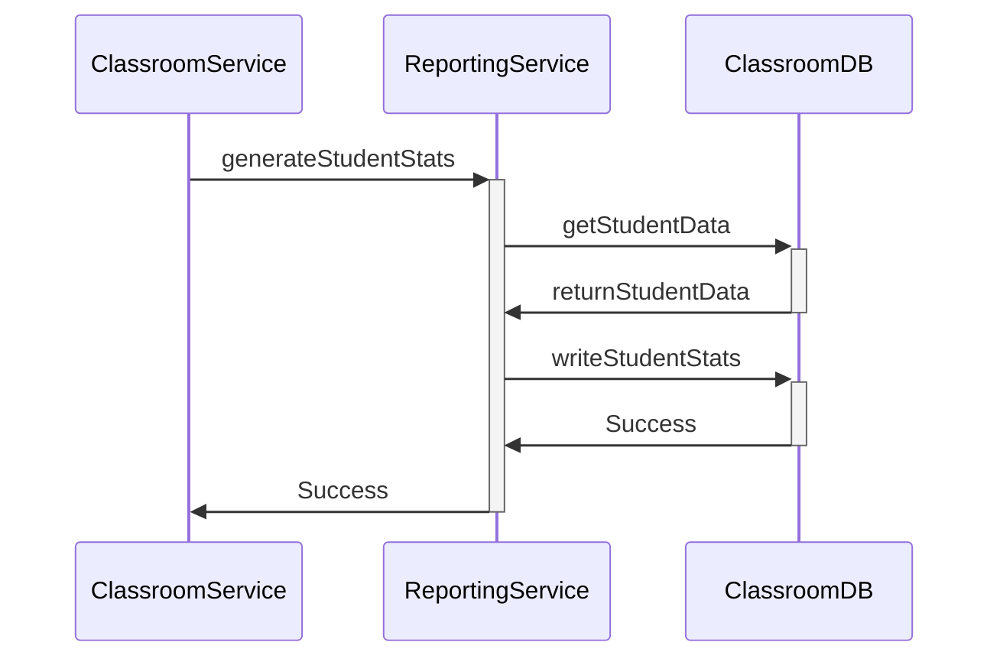
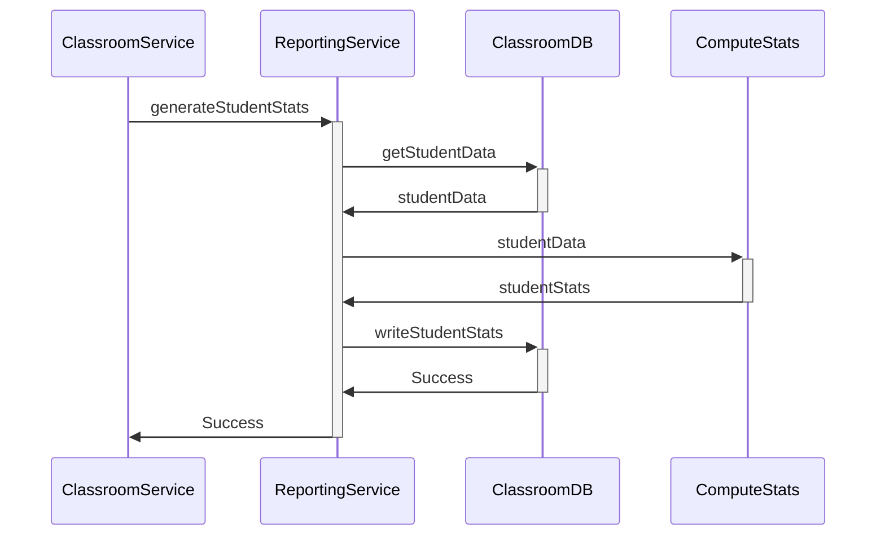

 Reporting generates student activity statistics
    - Reporting | assessmentDB

Question:
1. There is some algorithm running in ReportingService - SHOULD I show this, or should I add another layer saying something like "StatsComputing" like below.

