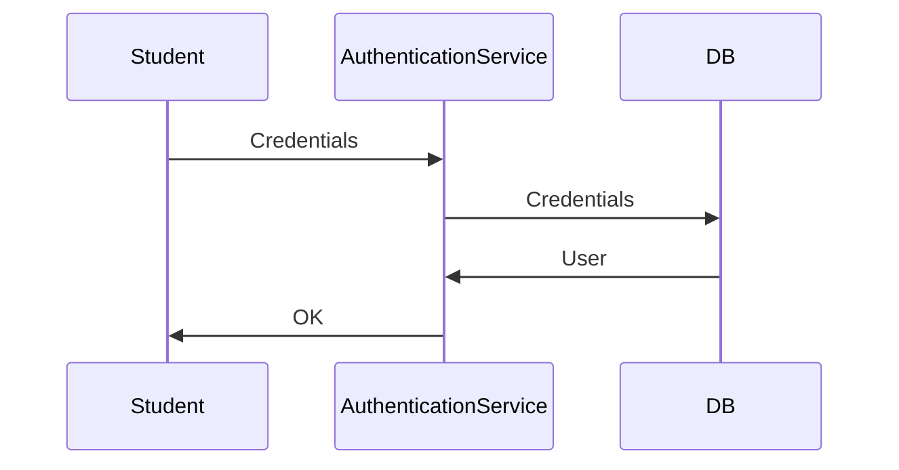

login

1. Student login vs Teacher login.
    - student client | auth
    - teach client | auth

```mermaid
sequenceDiagram
    Student ->> AuthenticationService: Credentials
    AuthenticationService ->> DB: Credentials
    DB ->> AuthenticationService: User
    AuthenticationService ->> Student: OK
```