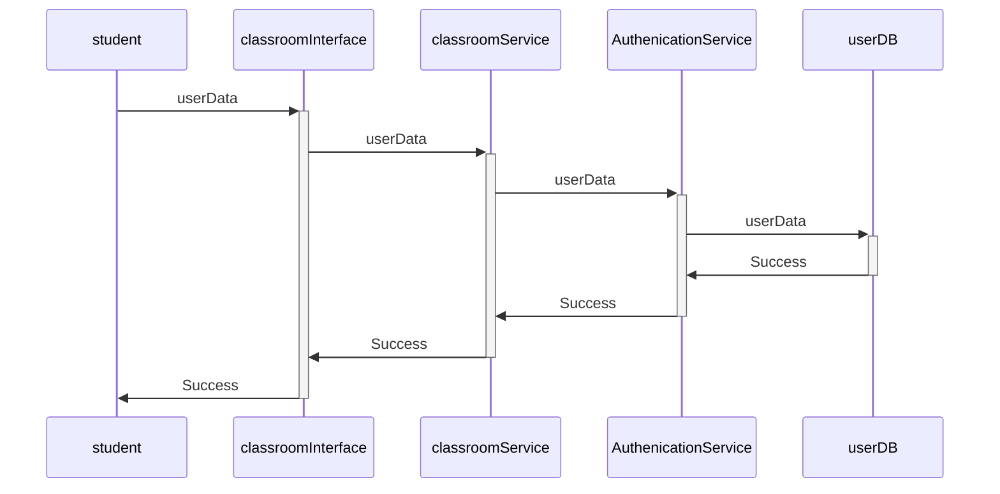

6. Student Joins classroom.
    - Student client | Auth | classroomService | userDB

```mermaid
sequenceDiagram
    student ->>+ classroomInterface: userData
    classroomInterface ->>+ classroomService: userData
    classroomService ->>+ AuthenicationService: userData
    AuthenicationService ->>+ userDB: userData
    userDB ->>- AuthenicationService: Success
    AuthenicationService ->>- classroomService: Success
    classroomService ->>- classroomInterface: Success
    classroomInterface ->>- student: Success
```
 